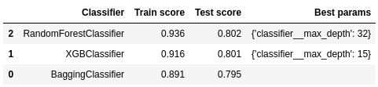
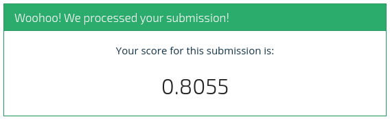

# Module 3 Final Project

Build model for prediction water pumps status on data from <a href="http://taarifa.org/" target="_blank">Taarifa</a> and the <a href="http://maji.go.tz/" target="_blank">Tanzanian Ministry of Water</a>.

## Contents

  * EDA.ipynb - preprocess data (exploratory data analysis)
  * visualisation.ipynb - all visualisations done through EDA
  * student.ipynb - main file with built model
  * import_libraries.py - helper file for import necessary libraries
  * helper.py - helper functions
  * data/
      * downloaded/ - folder with data from <a href="https://www.drivendata.org/competitions/7/pump-it-up-data-mining-the-water-table/" target="_blank">drivendata.org</a>
      * train_data.csv - train features
      * train_labels.csv - labels
      * test_data.csv - test features
      * SubmissionFormat.csv - test labels (which sould be predicted)

  * preprocessed/
      * data.pickle - selected features(filled na) and labels in one dataset
      * test_comb_cats.pickle - test part of data.pickle with combined  
      * train_comb_cats.pickle
      * train_comb_cats_cleaned.pickle
      * predicted_test_labels.csv
      * test_for_SM.pickle
      * train_for_SM.pickle
  * model/ - turns out that models are to big for uploading to github
      * model1.pickle - 1st iteration of models fitting 
      * model2.pickle - 2nd iteration of models fitting
      * model3.pickle - 3rd iteration of models fitting
      * model4.pickle - 4th iteration of models fitting

        
 

## Conclusions

We fitted several classification models and get the best result with RandomForestClassifier() and XGBClassifier(). 
Both behave well after tuning hyperparameters. 
 

 

#### Submission with only `RandomForestClassifier()` model (accuracy score: 0.802)

#### Submission with ensemble of `RandomForestClassifier()`, `XGBClassifier()` and `DecisionTreeClassifier()` using `VotingClassifier()`  (accuracy score: 0.806)

